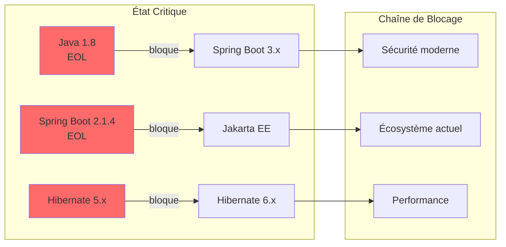

# Partie 2 — Dette Technique et Dépendances Obsolètes

> **Statut** : Complété

## 2.1 Analyse du pom.xml

Le projet WallRide utilise une structure Maven multi-module avec un BOM (Bill of Materials) centralisé dans `wallride-dependencies`. La gestion des versions est hiérarchique :

```
wallride (root aggregator)
├── wallride-dependencies (hérite de spring-boot-dependencies:2.1.4)
│   └── wallride-parent (hérite de wallride-dependencies)
│       └── wallride-bootstrap (hérite de wallride-parent)
├── wallride-core (hérite du root)
└── wallride-tools (hérite du root)
```

Le parent de `wallride-dependencies` est `spring-boot-dependencies:2.1.4.RELEASE`, ce qui signifie que la majorité des versions de dépendances Spring sont gérées par cette BOM.

## 2.2 Versions des Dépendances

### Dépendances principales

| Dépendance | Version actuelle | Dernière version stable | Écart | Statut |
|---|---|---|---|---|
| **Java** | 1.8 | 21 (LTS) | 13 versions majeures | EOL |
| **Spring Boot** | 2.1.4.RELEASE | 3.4.x | 2 versions majeures | EOL (oct. 2021) |
| **Hibernate Search** | 5.10.5.Final | 7.2.x | 2 versions majeures | Obsolète |
| **Lucene** | 5.5.5 | 9.12.x | 4 versions majeures | Obsolète |
| **Spring Cloud AWS** | 2.1.1.RELEASE | 3.2.x | 2 versions majeures | Obsolète |
| **Spring Mobile** | 1.1.5.RELEASE | — | Retiré du portfolio Spring | Déprécié |
| **Node.js** (build frontend) | 10.13.0 | 22.x (LTS) | 12 versions majeures | EOL (avr. 2021) |
| **npm** | 6.4.1 | 10.x | 4 versions majeures | Obsolète |

### Dépendances secondaires

| Dépendance | Version actuelle | Dernière version stable | Problème |
|---|---|---|---|
| **commons-lang** | 2.4 | commons-lang3 3.17.x | Remplacé par commons-lang3 |
| **commons-io** | 2.4 | 2.18.x | 14 versions de retard |
| **commons-fileupload** | 1.3.3 | 1.5.x (+ CVEs connues) | Vulnérabilités connues |
| **jsoup** | 1.7.2 | 1.18.x | 11 versions de retard |
| **javax.mail** | 1.4.1 | Jakarta Mail 2.1.x | Remplacé par Jakarta |
| **AWS SDK S3** | v1 (non versionné) | v2 (2.x) | SDK v1 en maintenance only |
| **Google Analytics API** | v3-rev119-1.20.0 | GA Data API v4 | API v3 dépréciée par Google |
| **Infinispan** | (géré par BOM) | 15.x | Probablement ~9.x via Boot 2.1 |

## 2.3 Java 1.8

### Pourquoi Java 1.8 est problématique aujourd'hui

1. **Fin de support public** : Oracle a arrêté les mises à jour publiques gratuites de Java 8 en janvier 2019. Seul le support commercial payant est encore disponible.

2. **Failles de sécurité** : sans mises à jour régulières, les CVE découvertes après janvier 2019 ne sont pas corrigées dans les builds publics.

3. **Fonctionnalités manquantes** : Java 8 ne dispose pas des améliorations majeures des versions ultérieures :
   - Java 9 : modules (Jigsaw)
   - Java 11 : HTTP Client, `var`, String methods
   - Java 14 : Records, Pattern Matching (preview)
   - Java 17 : Sealed classes, Pattern Matching for `instanceof`
   - Java 21 : Virtual Threads, Pattern Matching for switch

4. **Écosystème incompatible** : les versions récentes de Spring Boot 3.x, Hibernate 6.x, et la majorité des bibliothèques modernes exigent au minimum Java 17.

5. **Performance** : les JVM modernes (Java 17+) offrent des améliorations significatives en termes de garbage collection (ZGC, Shenandoah), de temps de démarrage et de consommation mémoire.

## 2.4 Spring Boot

### Version 2.1.4.RELEASE

- **Date de sortie** : avril 2019
- **Fin de support** : octobre 2021
- **Statut actuel** : **End of Life** — aucun patch de sécurité ni correctif

### Risques identifiés

1. **CVEs non corrigées** : toutes les vulnérabilités découvertes depuis octobre 2021 dans Spring Framework et Spring Boot ne sont pas corrigées dans cette version.

2. **Spring Framework 5.1.x** : cette version de Boot embarque Spring Framework 5.1.x, également EOL. La migration vers Spring Boot 3.x nécessite le passage à Spring Framework 6.x et l'API **Jakarta EE** (remplacement de `javax.*` par `jakarta.*`).

3. **Incompatibilité avec Java 17+** : Spring Boot 2.1.x ne supporte pas officiellement Java 17 (LTS actuel). Des problèmes d'accès aux modules internes de la JVM surviennent.

4. **Migration non triviale** : le passage de Spring Boot 2.x à 3.x implique :
   - Migration `javax` → `jakarta` (tous les imports)
   - Mise à jour de Hibernate 5.x → 6.x
   - Mise à jour de Spring Security (API restructurée)
   - Mise à jour de Thymeleaf 3.0 → 3.1

## 2.5 Hibernate et Hibernate Search

### Hibernate ORM

- **Version embarquée** : ~5.3.x (géré par Spring Boot 2.1.4)
- **Dernière version** : 6.6.x
- **Problème** : Hibernate 5.x utilise l'API `javax.persistence`, incompatible avec Jakarta EE (Hibernate 6.x)

### Hibernate Search

- **Version utilisée** : 5.10.5.Final
- **Dernière version** : 7.2.x
- **Breaking change majeur** : Hibernate Search 6.x a été entièrement réécrit avec une API incompatible. La migration nécessite une réécriture complète de toutes les annotations et requêtes de recherche.

### Lucene

- **Version utilisée** : 5.5.5
- **Dernière version** : 9.12.x
- **Risque** : les versions 5.x ne sont plus maintenues. Les formats d'index ne sont pas compatibles avec les versions 8.x+.

### Risques d'utiliser des versions obsolètes

1. **Vulnérabilités connues** : pas de patches de sécurité
2. **Incompatibilité** : impossible de mettre à jour Spring Boot sans mettre à jour Hibernate
3. **Performance** : les optimisations de requêtes et d'indexation des versions récentes ne sont pas disponibles
4. **Support communautaire** : aucune aide disponible pour les problèmes rencontrés sur ces anciennes versions

## 2.6 Autres Dépendances

### Architecture modulaire Maven

Le `pom.xml` montre 5 modules Maven + 2 modules UI Node.js :

| Module | Rôle | Pertinence |
|---|---|---|
| `wallride-dependencies` | BOM centralisé | Pertinent (bonne pratique) |
| `wallride-parent` | Configuration parent | Pertinent mais fusionnable avec dependencies |
| `wallride-core` | Logique métier complète | **Trop gros** — contient tout |
| `wallride-bootstrap` | Point d'entrée | Pertinent (séparation du démarrage) |
| `wallride-tools` | Outils de développement | Peu utilisé, potentiellement supprimable |
| `wallride-ui-admin` | Interface admin (Node.js) | Couplé au build Maven de core |
| `wallride-ui-guest` | Interface publique (Node.js) | Couplé au build Maven de core |

### Cette modularisation est-elle toujours pertinente ?

**Partiellement.** La séparation en BOM + parent + bootstrap est une bonne pratique. Cependant :

- **wallride-core est un monolithe déguisé** : il contient 335 fichiers Java couvrant domaine, service, repository et web. La "modularisation" Maven est une illusion — tout le code est dans un seul module.
- **wallride-parent et wallride-dependencies pourraient être fusionnés** : la séparation en deux POMs parents ajoute de la complexité sans bénéfice clair.
- **wallride-tools est sous-utilisé** : il ne contient que des outils de génération et pourrait être un simple profil Maven.
- **Le couplage UI/backend** : les modules UI sont construits via `frontend-maven-plugin` et empaquetés dans le JAR de core, ce qui rend impossible le déploiement indépendant du frontend.

### Dépendances inutilisées ou redondantes

1. **Spring Mobile** (`spring-mobile-device`) : bibliothèque retirée du portfolio Spring, plus maintenue. Le responsive design moderne rend cette dépendance inutile.
2. **Google Analytics API v3** : API dépréciée par Google, remplacée par la GA Data API v4.
3. **commons-lang 2.4** : version legacy, remplacée par `commons-lang3` depuis plus de 10 ans.
4. **javax.mail 1.4.1** : version très ancienne, remplacée par Jakarta Mail.
5. **Infinispan** : utilisé comme cache distribué et pour le stockage d'index Lucene, potentiellement surdimensionné pour un CMS — Redis ou Caffeine seraient plus simples.

## 2.7 Synthèse



**Verdict** : la dette technique liée aux dépendances est **massive et structurelle**. La mise à jour de Java, Spring Boot et Hibernate constitue un prérequis incontournable avant toute autre amélioration. La chaîne de dépendances obsolètes crée un effet domino qui rend impossible une mise à jour incrémentale — une migration "big bang" est nécessaire pour le socle technique.
