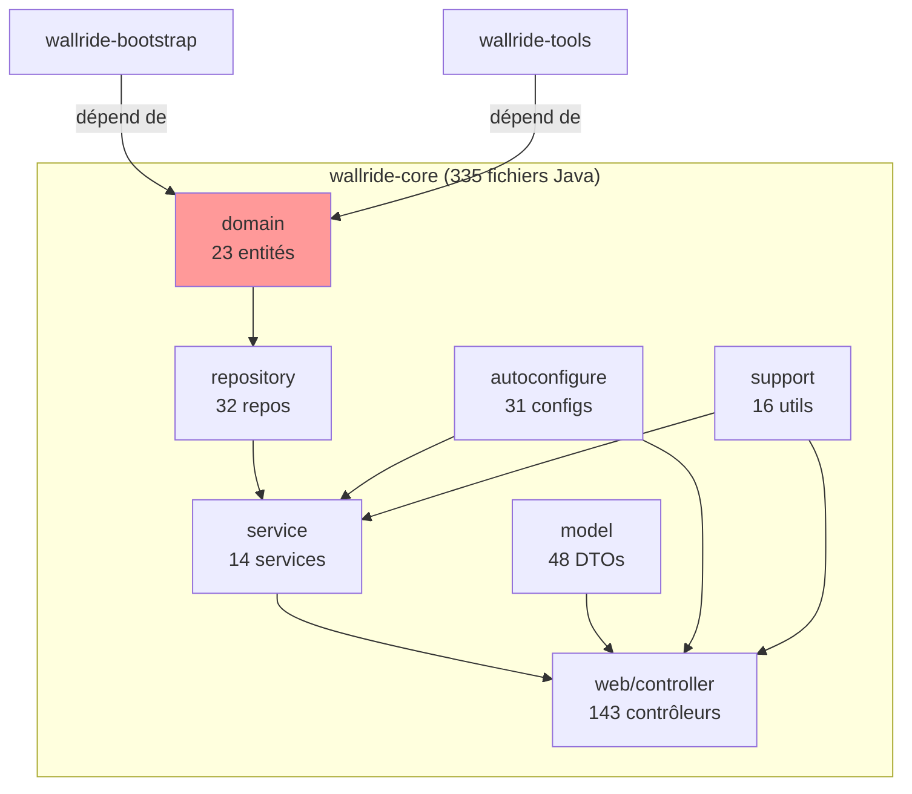
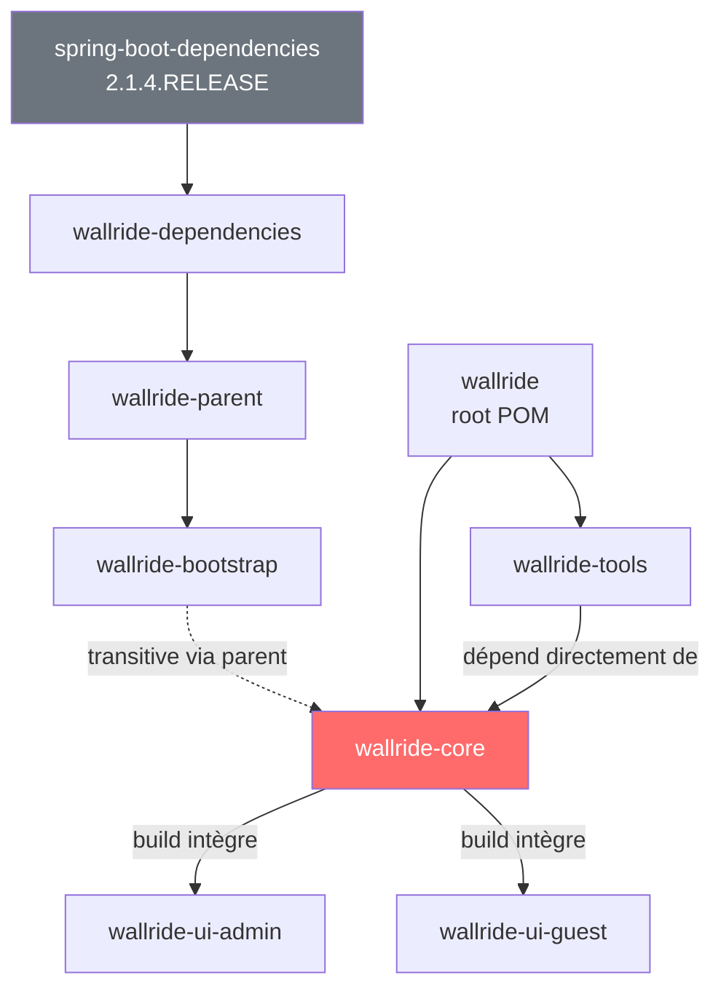
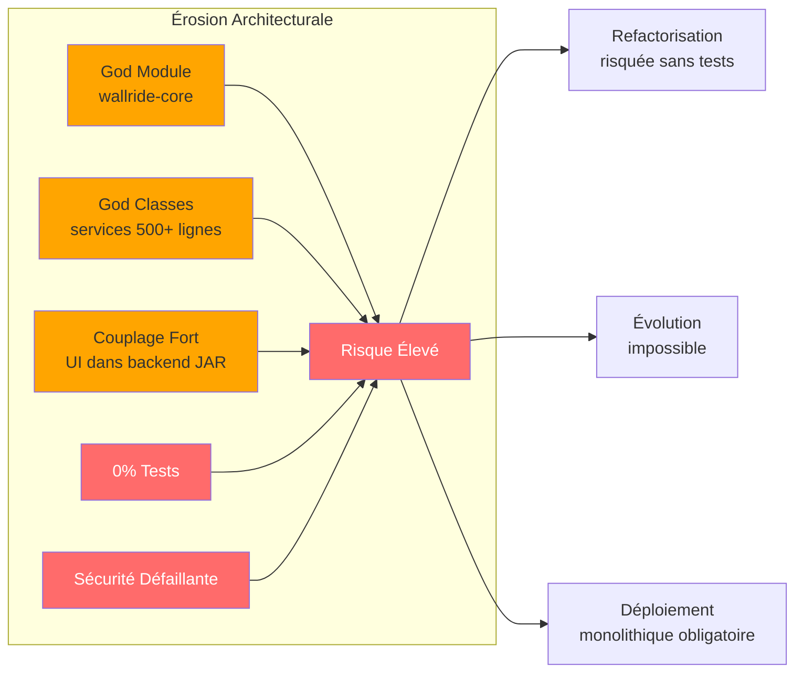

# Partie 3 — Érosion Architecturale

> **Statut** : Complété

## 3.1 Structure du Projet WallRide

### Vue d'ensemble

WallRide est un CMS Java open-source créé en 2014 par Tagbangers, Inc. Le projet est structuré en modules Maven avec un frontend Node.js intégré.

### Arborescence des modules

```
wallride/                          (root aggregator POM)
├── wallride-dependencies/         (BOM — gestion centralisée des versions)
│   └── pom.xml                    (parent: spring-boot-dependencies:2.1.4)
├── wallride-parent/               (POM parent pour les modules applicatifs)
│   └── pom.xml                    (parent: wallride-dependencies)
├── wallride-core/                 (335 fichiers Java — logique métier COMPLÈTE)
│   ├── src/main/java/org/wallride/
│   │   ├── autoconfigure/         (31 classes de configuration)
│   │   ├── domain/                (23 entités JPA)
│   │   ├── exception/             (9 classes d'exception)
│   │   ├── job/                   (3 jobs Spring Batch)
│   │   ├── model/                 (48 DTOs / objets de requête)
│   │   ├── repository/            (32 repositories JPA)
│   │   ├── service/               (14 services métier)
│   │   ├── support/               (16 utilitaires)
│   │   └── web/                   (159 fichiers — 47,5% du code!)
│   │       ├── controller/admin/  (117 contrôleurs admin)
│   │       ├── controller/guest/  (26 contrôleurs guest)
│   │       └── support/           (16 utilitaires web)
│   └── src/test/                  (2 fichiers de test seulement!)
├── wallride-bootstrap/            (point d'entrée applicatif)
│   └── pom.xml                    (parent: wallride-parent)
├── wallride-tools/                (outils de développement)
│   └── pom.xml                    (dépend de wallride-core)
├── wallride-ui-admin/             (66 fichiers — interface admin Node.js)
└── wallride-ui-guest/             (38 fichiers — interface publique Node.js)
```

## 3.2 Modèle Architectural

### Quel modèle est utilisé ?

WallRide est un **monolithe modulaire** (modular monolith), plus précisément un monolithe **MVC en couches** (Layered MVC) avec Spring Boot.

Cependant, la modularisation est **superficielle** :

| Caractéristique | Théorie | Réalité WallRide |
|---|---|---|
| Séparation des modules | Chaque module = un bounded context | `wallride-core` = 100% de la logique |
| Indépendance de déploiement | Modules déployables séparément | Tout est packagé dans un seul JAR |
| Interfaces bien définies | APIs claires entre modules | Dépendances directes sur les classes internes |
| Responsabilité unique | Un module = une responsabilité | `wallride-core` = domaine + service + web + config |

**Conclusion** : malgré une structure Maven multi-module, WallRide est un **monolithe classique** déguisé. La modularisation Maven ne reflète pas une réelle séparation architecturale.

## 3.3 Séparation des Modules

### Les modules sont-ils bien séparés ?

**Non.** Voici l'analyse module par module :

#### wallride-core (le "God Module")

Ce module concentre **100% de la logique applicative** :



**Problèmes** :
- Aucune séparation entre couches métier et présentation au niveau des modules
- Les contrôleurs sont dans le même module que les entités et les services
- Impossible de réutiliser la couche métier sans embarquer toute la couche web

#### wallride-dependencies / wallride-parent

Séparation en deux POMs parents : `dependencies` (BOM) et `parent` (configuration). Cette séparation est **redondante** — un seul POM parent suffirait.

#### wallride-bootstrap

Module minimal contenant uniquement le point d'entrée Spring Boot + les drivers de base de données. Bonne séparation, mais il hérite de `wallride-parent` qui tire `wallride-core` comme dépendance transitive.

#### wallride-tools

Dépend directement de `wallride-core`. Utilisé pour la génération de schéma et l'initialisation. Pourrait être un profil Maven au lieu d'un module séparé.

#### wallride-ui-admin / wallride-ui-guest

Projets Node.js construits par `frontend-maven-plugin` lors du build de `wallride-core`. Leur output (fichiers statiques) est copié dans les resources de `wallride-core`.

**Problème** : couplage fort entre le build frontend et le build backend. Impossible de développer, tester ou déployer le frontend indépendamment.

## 3.4 Dépendances entre Modules

### Graphe de dépendances



### Dépendances cycliques

**Aucune dépendance cyclique Maven détectée.** Le graphe est linéaire :

- `dependencies` → `parent` → `bootstrap` (chaîne d'héritage)
- `core` est la dépendance terminale (tout converge vers lui)
- `tools` dépend de `core` sans boucle

Cependant, au niveau des **packages internes** de `wallride-core`, les couches ne sont pas strictement respectées. Les contrôleurs accèdent parfois directement aux repositories, court-circuitant la couche service.

## 3.5 Principaux Problèmes d'Architecture

### Anti-pattern 1 : God Module

`wallride-core` contient tout : domaine, persistance, logique métier, contrôleurs web, configuration Spring. C'est l'exact opposé du principe de responsabilité unique.

**Impact** : toute modification, même mineure, nécessite de recompiler et redéployer l'ensemble du projet.

### Anti-pattern 2 : God Classes

| Classe | Lignes | Problème |
|---|---|---|
| `ArticleService` | 697 | Gère création, mise à jour, suppression, recherche, bulk operations |
| `PageService` | 667 | Même problème que ArticleService pour les pages |
| `UserService` | 458 | Authentification + CRUD + profil dans une seule classe |
| `PostService` | 334 | Recherche + manipulation de posts |

### Anti-pattern 3 : Couche Web surdimensionnée

La couche web représente **47,5% du code** (159 fichiers sur 335). Cela révèle :
- Des contrôleurs trop "gras" (fat controllers) contenant de la logique métier
- Une duplication probable entre les contrôleurs admin et guest
- Un manque d'abstraction dans la gestion des opérations CRUD

### Anti-pattern 4 : Modèle de domaine anémique

Les 23 entités du package `domain` sont des POJOs JPA avec uniquement des getters/setters. Toute la logique métier est dans les services. C'est le pattern [Anemic Domain Model](https://martinfowler.com/bliki/AnemicDomainModel.html) décrit par Martin Fowler.

### Anti-pattern 5 : Configuration monolithique

Les 31 classes de configuration dans `autoconfigure` gèrent tout dans un seul package : sécurité, cache, web, recherche, stockage. Aucune séparation par domaine fonctionnel.

### Anti-pattern 6 : Couplage Frontend/Backend

Le build Maven de `wallride-core` exécute `npm install` et `npm run build` pour les modules UI, puis copie le résultat dans ses resources. Cela crée :
- Un temps de build allongé
- Une impossibilité de déployer le frontend séparément (CDN, static hosting)
- Un couplage fort entre les cycles de développement frontend et backend

## 3.6 Fichiers les Plus Critiques

Les fichiers nécessitant le plus d'attention (basé sur la taille, la complexité et la centralité) :

| Fichier | Criticité | Raison |
|---|---|---|
| `service/ArticleService.java` | Très haute | 697 lignes, God class, cœur fonctionnel |
| `service/PageService.java` | Très haute | 667 lignes, God class |
| `service/UserService.java` | Haute | 458 lignes, gère l'authentification |
| `autoconfigure/WallRideSecurityConfiguration.java` | Critique | CSRF désactivé, headers désactivés |
| `autoconfigure/WallRideWebMvcConfiguration.java` | Haute | Configuration web centralisée |
| `wallride-core/pom.xml` | Haute | 30+ dépendances directes |

## 3.7 Comparaison avec les Bonnes Pratiques Modernes

| Aspect | WallRide (2019) | Bonnes pratiques (2026) |
|---|---|---|
| **Architecture** | Monolithe MVC en couches | Monolithe modulaire / Hexagonal / Microservices |
| **Séparation des couches** | Tout dans `wallride-core` | Modules par bounded context (DDD) |
| **Frontend** | Couplé au build Maven | SPA séparé (React/Vue) + API REST/GraphQL |
| **Tests** | 2 classes de test | 80%+ de couverture, tests unitaires + intégration |
| **Sécurité** | CSRF désactivé, password encoder déprécié | Spring Security 6.x, BCrypt, CSRF activé |
| **CI/CD** | Aucune | GitHub Actions, SonarCloud, déploiement automatisé |
| **Conteneurisation** | Aucune | Docker, Kubernetes |
| **Observabilité** | Aucune | Micrometer, OpenTelemetry, structured logging |

## 3.8 Synthèse



**L'architecture de WallRide souffre d'une érosion avancée.** La modularisation Maven est cosmétique — le projet est en réalité un monolithe dense avec un couplage fort, des classes surdimensionnées, une absence de tests et des failles de sécurité structurelles. Toute tentative de modernisation devra commencer par la mise en place de tests avant de pouvoir refactoriser l'architecture en toute sécurité.
