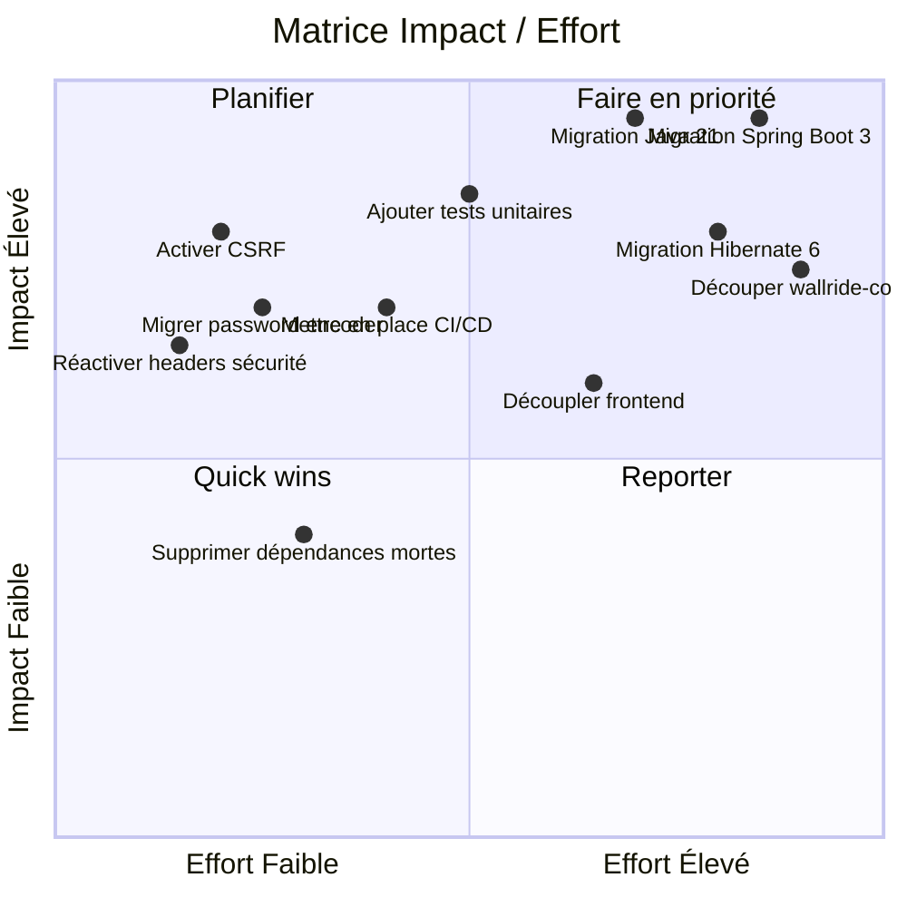
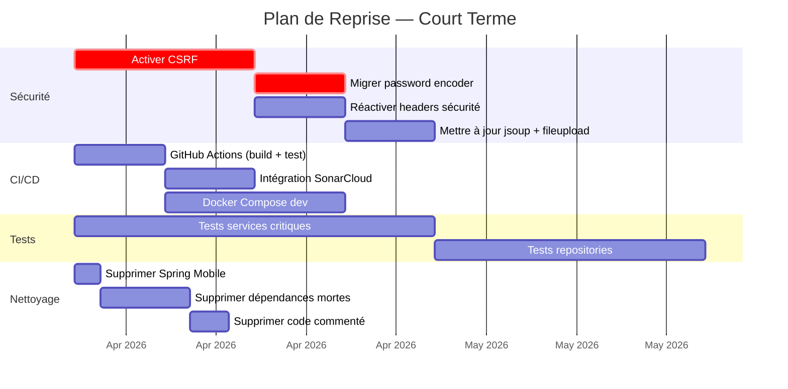
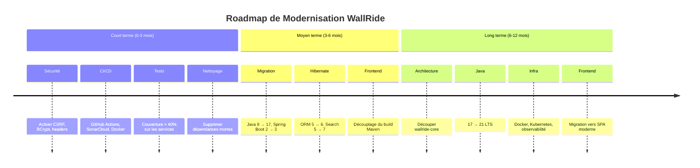

# Partie 4 — Élaboration du Plan de Reprise

> **Statut** : Complété

## 4.1 Constats Principaux

L'audit des parties 1 à 3 a mis en évidence les problèmes suivants :

| # | Constat | Sévérité | Impact |
|---|---|---|---|
| 1 | Java 1.8, Spring Boot 2.1.4, Hibernate 5.x — tous EOL | Critique | Bloque toute évolution |
| 2 | Failles de sécurité (CSRF désactivé, password encoder déprécié) | Critique | Vulnérabilité en production |
| 3 | Couverture de tests ~0% (2 classes / 335 fichiers) | Critique | Refactorisation risquée |
| 4 | God Module (`wallride-core` = 100% de la logique) | Majeur | Maintenance impossible |
| 5 | God Classes (ArticleService 697 lignes, PageService 667 lignes) | Majeur | Complexité excessive |
| 6 | Frontend couplé au build Maven | Majeur | Pas de déploiement indépendant |
| 7 | Dépendances dépréciées (Spring Mobile, commons-lang 2, GA v3) | Moyen | Dette technique croissante |
| 8 | Absence de CI/CD | Moyen | Pas de filet de sécurité |
| 9 | Bus factor = 1 (74% commits par un seul dev) | Moyen | Risque organisationnel |

## 4.2 Définition des Priorités — 3 Actions Prioritaires

### Priorité 1 : Mise à jour des technologies critiques

**Objectif** : Passer sur un socle technique supporté et sécurisé.

| Action | De | Vers |
|---|---|---|
| Java | 1.8 | 21 (LTS) |
| Spring Boot | 2.1.4.RELEASE | 3.4.x |
| Spring Framework | 5.1.x | 6.2.x |
| Hibernate ORM | 5.3.x | 6.6.x |
| Hibernate Search | 5.10.5.Final | 7.2.x |
| Lucene | 5.5.5 | 9.12.x |
| `javax.*` | javax | `jakarta.*` |

**Pourquoi en premier** : tant que le socle technique est obsolète, aucune autre amélioration n'est viable. Les patches de sécurité, les nouvelles fonctionnalités du framework et le support communautaire dépendent de cette migration.

### Priorité 2 : Correction des problèmes de sécurité

**Objectif** : Éliminer les vulnérabilités structurelles identifiées.

| Action | Détail |
|---|---|
| Activer CSRF | Retirer `.csrf().disable()` des configurations admin et guest |
| Migrer le password encoder | `StandardPasswordEncoder` → `BCryptPasswordEncoder` |
| Réactiver les headers de sécurité | HSTS, X-Frame-Options, Cache-Control |
| Mettre à jour commons-fileupload | Version 1.3.3 → 1.5+ (CVEs connues) |
| Mettre à jour jsoup | Version 1.7.2 → 1.18+ |
| Résoudre les issues #98 et #122 | Problèmes de sécurité signalés sur GitHub |

**Pourquoi en deuxième** : ces failles exposent le système en production. Certaines corrections (CSRF, password encoder) sont indépendantes de la migration Spring Boot et peuvent être commencées en parallèle.

### Priorité 3 : Refactoring des modules les plus problématiques

**Objectif** : Réduire la complexité et améliorer la maintenabilité.

| Action | Détail |
|---|---|
| Découper `wallride-core` | Séparer en modules : domain, service, web-admin, web-guest |
| Refactoriser ArticleService | Extraire en sous-services : ArticleCreateService, ArticleSearchService, etc. |
| Refactoriser PageService | Même approche que ArticleService |
| Découpler le frontend | Séparer le build Node.js du build Maven, exposer une API REST |
| Supprimer les dépendances mortes | Spring Mobile, commons-lang 2, Google Analytics v3 |

## 4.3 Priorisation (Impact / Effort)

## 4.4 Stratégie de Refactorisation

### Élimination des dépendances obsolètes

| Bibliothèque à remplacer | Remplacement | Effort |
|---|---|---|
| `spring-mobile-device` | Supprimer (responsive CSS suffit) | Faible |
| `commons-lang` 2.4 | `commons-lang3` 3.17.x | Faible |
| `javax.mail` 1.4.1 | `jakarta.mail` 2.1.x | Moyen |
| `Google Analytics v3` | GA Data API v4 ou suppression | Moyen |
| `AWS SDK v1` | AWS SDK v2 | Moyen |
| `commons-fileupload` 1.3.3 | `commons-fileupload2` ou Spring multipart | Moyen |
| `Infinispan` (cache) | Spring Cache + Caffeine ou Redis | Élevé |
| `Hibernate Search` 5.10 | Hibernate Search 7.x (réécriture API) | Élevé |

### Réduction de la dette technique — Fichiers prioritaires

| Fichier | Lignes | Action |
|---|---|---|
| `ArticleService.java` | 697 | Découper en 4-5 sous-services par responsabilité |
| `PageService.java` | 667 | Même approche |
| `UserService.java` | 458 | Séparer authentification / gestion de profil |
| `WallRideSecurityConfiguration` | — | Réécrire avec Spring Security 6.x et bonnes pratiques |
| Contrôleurs admin (117 fichiers) | — | Identifier la duplication, extraire un contrôleur CRUD générique |

### Amélioration de la maintenabilité

1. **Documentation** :
   - Ajouter un README technique avec les instructions de build et déploiement
   - Documenter l'architecture dans un ADR (Architecture Decision Record)
   - Ajouter des JavaDoc sur les services et entités principaux

2. **Réorganisation du code** :
   - Adopter une structure par domaine fonctionnel (article, page, user, blog) au lieu de par couche technique
   - Séparer les DTOs de requête des DTOs de réponse
   - Introduire des interfaces pour les services (faciliter le testing)

3. **Qualité de code** :
   - Standardiser l'injection de dépendances (utiliser uniquement `@Autowired` ou constructor injection)
   - Supprimer le code commenté
   - Appliquer un formateur de code uniforme (Checkstyle ou Spotless)

### Mise en place CI/CD et tests

| Action | Outil | Objectif |
|---|---|---|
| Pipeline CI | GitHub Actions | Build + tests automatiques à chaque PR |
| Analyse statique | SonarCloud | Suivi continu de la dette technique |
| Tests unitaires | JUnit 5 + Mockito | Couverture > 60% sur les services |
| Tests d'intégration | Spring Boot Test + H2 | Vérifier les repositories et configs |
| Tests E2E | Selenium ou Playwright | Vérifier les parcours utilisateur critiques |
| Conteneurisation | Docker + Docker Compose | Environnement de développement reproductible |
| Formatage | Checkstyle / Spotless | Uniformité du code |

## 4.5 Actions par Horizon Temporel

### Court terme (0-3 mois) — Stabilisation

### Moyen terme (3-6 mois) — Migration technique

| Phase | Action | Durée estimée |
|---|---|---|
| Phase A | Migration Java 8 → Java 17 (étape intermédiaire) | 3 semaines |
| Phase B | Migration Spring Boot 2.1 → 2.7 (dernière 2.x) | 4 semaines |
| Phase C | Migration `javax` → `jakarta` + Spring Boot 3.x | 4 semaines |
| Phase D | Migration Hibernate Search 5.x → 6.x/7.x | 3 semaines |
| Phase E | Découpler le build frontend (API REST) | 3 semaines |

### Long terme (6-12 mois) — Modernisation architecturale

| Phase | Action | Durée estimée |
|---|---|---|
| Phase F | Découper `wallride-core` en modules par domaine | 6 semaines |
| Phase G | Passage Java 17 → Java 21 (LTS) | 2 semaines |
| Phase H | Conteneurisation complète (Docker + K8s) | 3 semaines |
| Phase I | Observabilité (Micrometer, structured logging) | 2 semaines |
| Phase J | Migration frontend vers SPA moderne (React/Vue) | 8 semaines |

## 4.6 Synthèse

### Roadmap globale

### Effort total estimé

| Horizon | Effort estimé | Équipe recommandée |
|---|---|---|
| Court terme | 2-3 mois | 1-2 développeurs |
| Moyen terme | 3-4 mois | 2-3 développeurs |
| Long terme | 4-6 mois | 2-3 développeurs |
| **Total** | **9-13 mois** | **2-3 développeurs** |

**Coût estimé** : entre 9 et 13 mois-homme de développement pour une modernisation complète. Ce chiffre suppose une équipe familière avec l'écosystème Spring Boot et les pratiques de migration.
