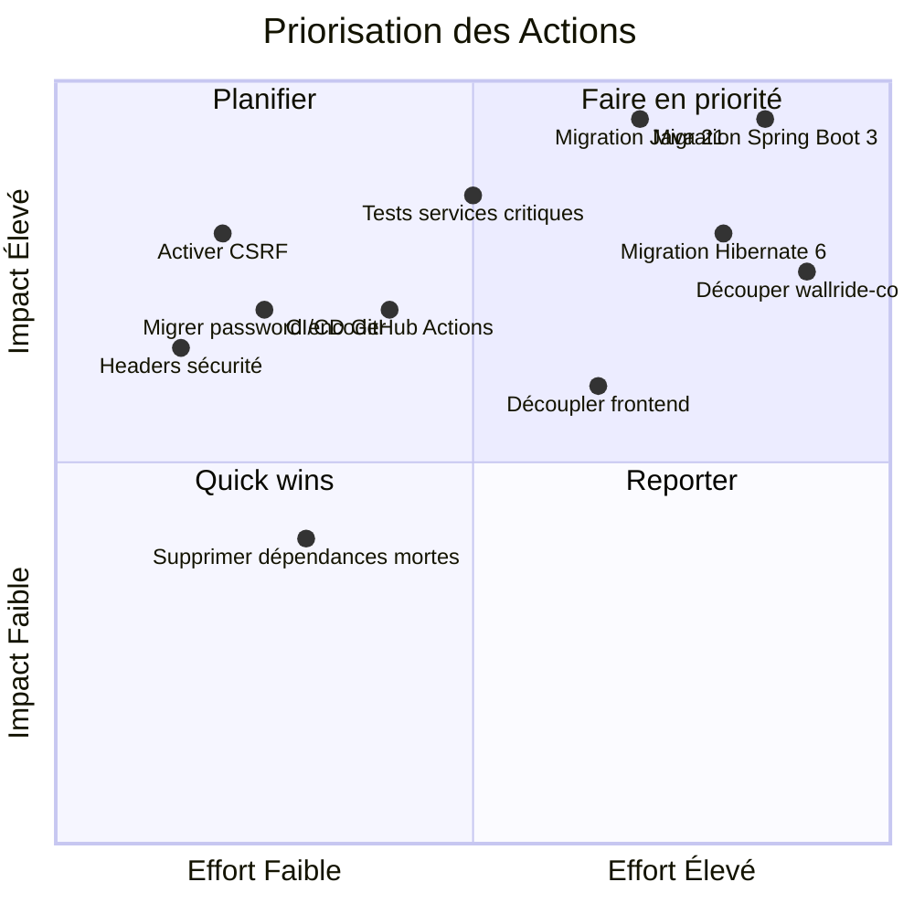
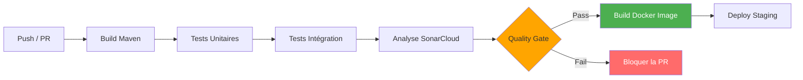
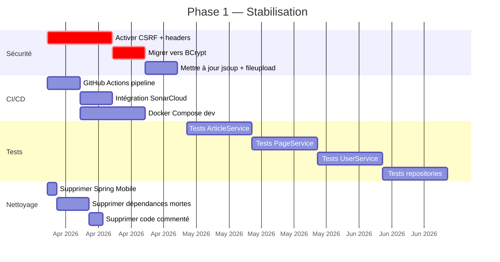

# Plan de Reprise — WallRide CMS

**Auteur :** Benoît Bremaud
**Date :** 25 mars 2026
**Classe :** M1 Web Full Stack — Ynov

---

## 1. Objectifs du Plan de Reprise

Ce plan vise à transformer WallRide d'un CMS abandonné en un projet maintenable et sécurisé. Les objectifs sont :

1. **Sécuriser** le système (corriger les failles critiques identifiées)
2. **Moderniser** le socle technique (Java 21, Spring Boot 3.x, Jakarta EE)
3. **Fiabiliser** le code (tests, CI/CD, analyse continue)
4. **Améliorer la maintenabilité** (découpage modulaire, documentation)

---

## 2. Priorisation des Actions

### 2.1 Matrice Impact / Effort



### 2.2 Synthèse des Priorités

| Priorité | Catégorie | Actions |
| --- | --- | --- |
| **P0** | Sécurité immédiate | Activer CSRF, migrer BCrypt, réactiver headers, mettre à jour jsoup/fileupload |
| **P1** | Fiabilisation | Tests sur services critiques, pipeline CI/CD, intégration SonarCloud |
| **P2** | Migration technique | Java 8→21, Spring Boot 2→3, Hibernate 5→6, javax→jakarta |
| **P3** | Architecture | Découper wallride-core, découpler frontend, refactoriser God classes |

---

## 3. Stratégie de Refactoring

### 3.1 Élimination des Dépendances Obsolètes

| Bibliothèque actuelle | Action | Remplacement |
| --- | --- | --- |
| `spring-mobile-device` 1.1.5 | Supprimer | Aucun (responsive CSS) |
| `commons-lang` 2.4 | Remplacer | `commons-lang3` 3.17.x |
| `javax.mail` 1.4.1 | Remplacer | `jakarta.mail` 2.1.x |
| `Google Analytics v3` | Supprimer ou remplacer | GA Data API v4 |
| `AWS SDK v1` | Remplacer | AWS SDK v2 |
| `commons-fileupload` 1.3.3 | Remplacer | Spring Multipart natif |
| `Infinispan` (cache) | Simplifier | Spring Cache + Caffeine |
| `Hibernate Search` 5.10.5 | Réécrire | Hibernate Search 7.x |

### 3.2 Réduction de la Dette Technique — Fichiers Prioritaires

| Fichier | Problème | Action de refactoring |
| --- | --- | --- |
| `ArticleService.java` (697 lignes) | God class, responsabilités multiples | Extraire : `ArticleCreateService`, `ArticleSearchService`, `ArticleBulkService` |
| `PageService.java` (667 lignes) | God class | Même découpage que ArticleService |
| `UserService.java` (458 lignes) | Auth + CRUD mélangés | Séparer `AuthenticationService` et `UserProfileService` |
| `WallRideSecurityConfiguration` | CSRF off, headers off | Réécrire avec Spring Security 6.x, activer toutes les protections |
| Contrôleurs admin (117 fichiers) | Duplication CRUD | Extraire un `AbstractCrudController` générique |

### 3.3 Amélioration de la Maintenabilité

**Documentation :**

- README technique avec instructions de build/déploiement
- Architecture Decision Records (ADR) pour les choix de migration
- JavaDoc sur les services et entités principaux

**Réorganisation du code :**

- Passer d'une structure par couche technique à une structure par **domaine fonctionnel** :

```text
wallride-core/
├── article/        (entity, repository, service, controller)
├── page/           (entity, repository, service, controller)
├── user/           (entity, repository, service, controller)
├── blog/           (entity, repository, service, controller)
├── comment/        (entity, repository, service, controller)
└── shared/         (configuration, utilitaires transversaux)
```

**Qualité de code :**

- Standardiser l'injection : constructor injection uniquement
- Supprimer tout le code commenté
- Appliquer un formateur (Spotless Maven plugin)

---

## 4. Mise en Place CI/CD

### 4.1 Pipeline Proposé



### 4.2 Outils

| Outil | Rôle |
| --- | --- |
| **GitHub Actions** | Pipeline CI/CD principal |
| **SonarCloud** | Analyse statique continue, suivi de la dette |
| **JUnit 5 + Mockito** | Tests unitaires des services |
| **Spring Boot Test + H2** | Tests d'intégration (repositories, configs) |
| **Testcontainers** | Tests d'intégration avec MySQL/PostgreSQL réel |
| **Docker + Docker Compose** | Environnement de développement reproductible |
| **Spotless** | Formateur de code automatique |
| **Dependabot** | Alertes de dépendances vulnérables |

### 4.3 Objectifs de Qualité

| Métrique | Objectif court terme | Objectif long terme |
| --- | --- | --- |
| Couverture de code | > 40% | > 70% |
| Bugs SonarCloud | Réduire de 50% | 0 bug critique/majeur |
| Vulnérabilités | 0 critique | 0 toutes sévérités |
| Duplication | < 10% | < 5% |
| Quality Gate | N/A | Pass systématique |

---

## 5. Roadmap

### 5.1 Phase 1 — Stabilisation (Mois 1-3)

**Objectif :** sécuriser le système et mettre en place le filet de sécurité.



**Livrables :**

- Pipeline CI fonctionnel (build + tests + SonarCloud)
- Failles de sécurité critiques corrigées
- Couverture > 40% sur les services principaux
- Dépendances mortes supprimées

### 5.2 Phase 2 — Migration Technique (Mois 3-6)

**Objectif :** moderniser le socle technique vers des versions supportées.

| Étape | Action | Durée | Risque |
| --- | --- | --- | --- |
| 2.1 | Java 8 → Java 17 (LTS intermédiaire) | 3 semaines | Moyen |
| 2.2 | Spring Boot 2.1 → 2.7 (dernière 2.x) | 4 semaines | Moyen |
| 2.3 | `javax.*` → `jakarta.*` + Spring Boot 3.x | 4 semaines | Élevé |
| 2.4 | Hibernate Search 5.x → 7.x + Lucene 9.x | 3 semaines | Élevé |
| 2.5 | Découpler le build frontend (API REST) | 3 semaines | Moyen |

**Stratégie de migration Spring Boot :**

La migration se fait en deux étapes pour limiter les risques :

1. **2.1 → 2.7** : migration incrémentale au sein de Spring Boot 2.x (compatible Java 8-17)
2. **2.7 → 3.x** : migration `javax` → `jakarta` + Spring Security 6.x

**Livrables :**

- Application fonctionnelle sur Java 17 + Spring Boot 3.x
- Hibernate Search 7.x avec Lucene 9.x
- Frontend découplé du build Maven
- Tous les tests existants passent

### 5.3 Phase 3 — Modernisation Architecturale (Mois 6-12)

**Objectif :** améliorer la maintenabilité à long terme.

| Étape | Action | Durée |
| --- | --- | --- |
| 3.1 | Découper `wallride-core` en modules par domaine | 6 semaines |
| 3.2 | Refactoriser les God classes | 3 semaines |
| 3.3 | Java 17 → Java 21 (LTS) | 2 semaines |
| 3.4 | Conteneurisation Docker + K8s | 3 semaines |
| 3.5 | Observabilité (Micrometer, structured logging) | 2 semaines |
| 3.6 | Migration frontend vers SPA (React/Vue) | 8 semaines |

**Livrables :**

- Architecture modulaire par domaine fonctionnel
- Services refactorisés (< 200 lignes chacun)
- Déploiement conteneurisé
- Couverture > 70%

---

## 6. Synthèse

### Effort Total

| Phase | Durée | Équipe | Coût estimé (mois-homme) |
| --- | --- | --- | --- |
| Phase 1 — Stabilisation | 2-3 mois | 1-2 devs | 3-5 |
| Phase 2 — Migration | 3-4 mois | 2-3 devs | 6-10 |
| Phase 3 — Modernisation | 4-6 mois | 2-3 devs | 8-15 |
| **Total** | **9-13 mois** | **2-3 devs** | **17-30 mois-homme** |

### Facteurs de Succès

1. **Tests d'abord** : ne jamais refactoriser sans couverture de tests adéquate
2. **Migration incrémentale** : Spring Boot 2.1 → 2.7 → 3.x (pas de saut direct)
3. **CI/CD dès le jour 1** : chaque changement doit être validé automatiquement
4. **Documentation continue** : ADR pour chaque décision technique majeure
5. **Revues de code** : toute modification par PR avec revue obligatoire

### Risques Principaux

| Risque | Probabilité | Impact | Mitigation |
| --- | --- | --- | --- |
| Régression lors de la migration Spring Boot | Élevée | Élevé | Tests + migration en 2 étapes |
| Réécriture Hibernate Search trop coûteuse | Moyenne | Élevé | Évaluer une alternative (Elasticsearch) |
| Absence de mainteneur avec connaissance du code | Élevée | Moyen | Documentation extensive, pair programming |
| Budget insuffisant pour modernisation complète | Moyenne | Élevé | Prioriser Phase 1 (sécurité + tests) |
