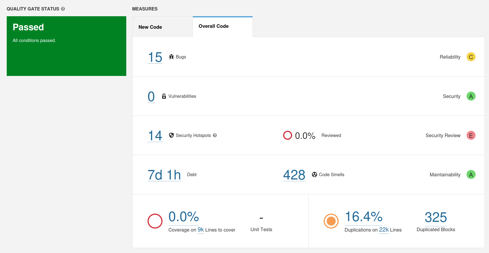
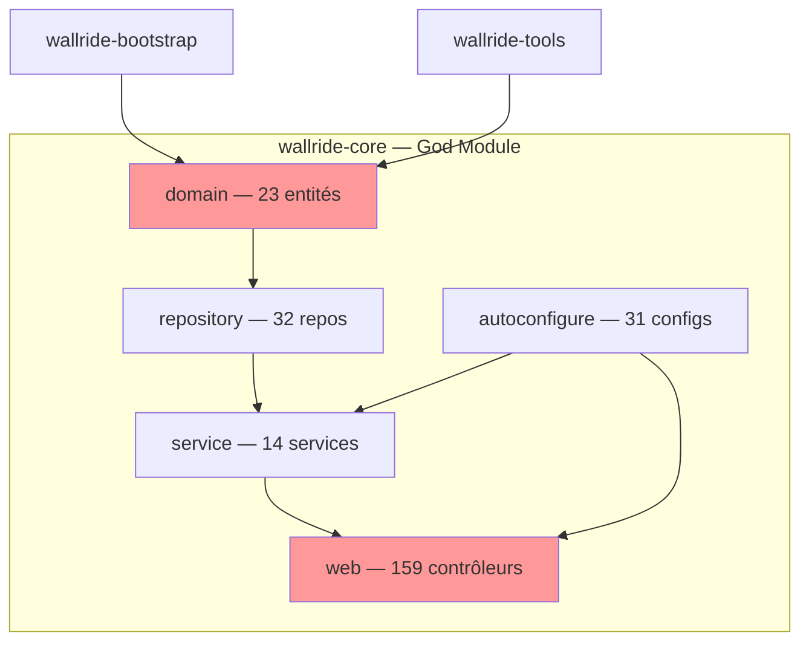
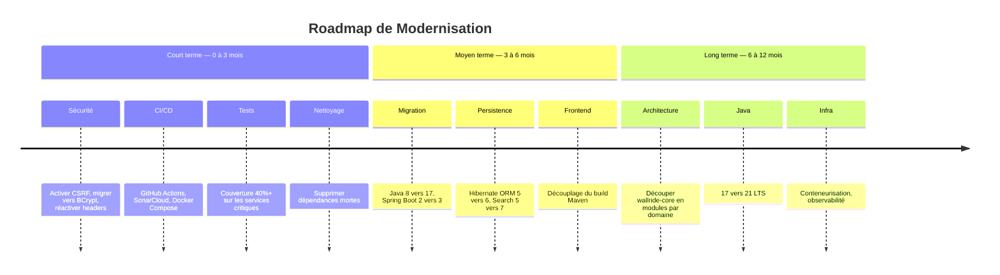

# Rapport d'Audit Technique — WallRide CMS

**Sujet :** Diagnostic et plan de reprise d'un CMS Java abandonné
**Auteur :** Benoît Bremaud
**Date :** 25 mars 2026
**Classe :** M1 Web Full Stack — Ynov

---

## Table des Matières

1. [Introduction](#1-introduction)
2. [Analyse SonarCloud](#2-analyse-sonarcloud)
3. [Obsolescence des Dépendances](#3-obsolescence-des-dépendances)
4. [Érosion Architecturale](#4-érosion-architecturale)
5. [Plan de Reprise](#5-plan-de-reprise)
6. [Conclusion](#6-conclusion)

---

## 1. Introduction

### 1.1 Contexte

L'entreprise fictive **WebRevive** a récemment acquis **WallRide**, un CMS Java open-source créé en 2014 par Tagbangers, Inc. Le projet, autrefois prometteur (98 stars, 96 forks sur GitHub), a été abandonné depuis **avril 2019** — soit plus de 7 ans sans mise à jour.

WallRide est construit sur **Spring Boot 2.1.4**, **Java 1.8** et **Hibernate Search 5.10.5**. Il propose une gestion multilingue de contenu (articles, pages, commentaires) avec une interface d'administration et une interface publique.

### 1.2 Objectifs de l'Audit

Cet audit technique vise à :

- Évaluer l'état de santé du code via **SonarCloud** (dette technique, bugs, vulnérabilités, code smells)
- Identifier les **dépendances obsolètes** et les risques de sécurité associés
- Analyser l'**érosion architecturale** et la viabilité de la structure modulaire
- Proposer un **plan de reprise** réaliste avec une roadmap priorisée

### 1.3 Périmètre

L'audit couvre l'intégralité du dépôt [tagbangers/wallride](https://github.com/tagbangers/wallride) :

- **335 fichiers Java** répartis dans 5 modules Maven
- **2 modules UI** (Node.js) pour l'interface admin et l'interface publique
- **744 commits** par 10 contributeurs (dont 74% par un seul développeur)

---

## 2. Analyse SonarCloud

### 2.1 Configuration

Le fork `benoit-bremaud/wallride` a été analysé avec **SonarQube 9.9.8 LTS** (Community Edition, Docker local). Le projet a été créé manuellement dans SonarQube, puis analysé via `sonar-scanner` sur les 340 fichiers source Java.

### 2.2 Dashboard

### 2.2 Métriques Clés

#### Dette technique

| Métrique | Valeur |
| --- | --- |
| Dette technique estimée | **7 jours 1 heure** |
| Code smells | **428** (99 critiques, 189 majeurs, 139 mineurs) |
| Duplication | **16.4%** (325 blocs dupliqués sur 22k lignes) |
| Couverture | **0.0%** (9 000 lignes à couvrir, aucun test exécuté) |
| Fichiers les plus endettés | `ArticleService.java` (697 lignes), `PageService.java` (667 lignes) |

#### Bugs et Vulnérabilités

| Métrique | Valeur | Rating |
| --- | --- | --- |
| Bugs | **15** (14 majeurs, 1 mineur) | **C** (Reliability) |
| Vulnérabilités | **0** | **A** (Security) |
| Security Hotspots | **14** (0% reviewed) | **E** (Security Review) |

**Failles structurelles identifiées par analyse manuelle :**

1. **CSRF désactivé** dans les configurations admin et guest (`.csrf().disable()`)
2. **StandardPasswordEncoder** déprécié utilisé au lieu de BCrypt
3. **Headers de sécurité désactivés** : HSTS, X-Frame-Options, Cache-Control
4. **Issues GitHub #98 et #122** : problèmes de sécurité non résolus depuis 2018/2023

#### Code Smells

**Principaux problèmes relevés :**

- **God Classes** : services métier dépassant 500 lignes avec trop de responsabilités
- **Mélange de standards DI** : `@Resource`, `@Inject` et `@Autowired` utilisés simultanément
- **Code mort** : configurations AWS et actuator commentées dans le code de production
- **Couche web surdimensionnée** : 159 fichiers (47,5% du code) dans le package `web`
- **Couverture de tests quasi nulle** : 2 classes de test pour 335 fichiers source (~0%)

### 2.3 Interprétation

Le projet présente une **dette technique critique** concentrée sur :

- Les **services métier** (ArticleService, PageService, UserService) — complexité excessive
- La **couche web** — duplication probable entre contrôleurs admin/guest
- La **configuration de sécurité** — failles structurelles non corrigées

L'absence quasi totale de tests rend toute intervention sur le code extrêmement risquée.

---

## 3. Obsolescence des Dépendances

### 3.1 Technologies Principales

| Technologie | Version WallRide | Version actuelle | Statut |
| --- | --- | --- | --- |
| Java | 1.8 | 21 (LTS) | **EOL** depuis jan. 2019 |
| Spring Boot | 2.1.4.RELEASE | 3.4.x | **EOL** depuis oct. 2021 |
| Hibernate Search | 5.10.5.Final | 7.2.x | Obsolète (API réécrite) |
| Lucene | 5.5.5 | 9.12.x | Obsolète |
| Node.js (build) | 10.13.0 | 22.x LTS | **EOL** depuis avr. 2021 |

### 3.2 Analyse par Technologie

**Java 1.8** — Problématique car : fin des patches de sécurité publics, incompatibilité avec les frameworks modernes (Spring Boot 3.x exige Java 17+), absence des fonctionnalités critiques (Records, Virtual Threads, Pattern Matching).

**Spring Boot 2.1.4** — Aucun patch de sécurité depuis octobre 2021. La migration vers 3.x nécessite le passage complet de `javax.*` à `jakarta.*` (Jakarta EE).

**Hibernate Search 5.10.5** — L'API a été entièrement réécrite en version 6.x. La migration nécessite une réécriture complète des annotations et requêtes de recherche.

### 3.3 Dépendances Dépréciées

| Bibliothèque | Problème |
| --- | --- |
| Spring Mobile 1.1.5 | Retirée du portfolio Spring |
| commons-lang 2.4 | Remplacée par commons-lang3 depuis 10+ ans |
| javax.mail 1.4.1 | Remplacée par Jakarta Mail |
| Google Analytics v3 | API dépréciée par Google |
| AWS SDK v1 | En maintenance only |

### 3.4 Structure Modulaire Maven

La modularisation en 7 modules est **partiellement pertinente** :

- **Bonne pratique** : BOM centralisé (`wallride-dependencies`), point d'entrée séparé (`wallride-bootstrap`)
- **Problème majeur** : `wallride-core` contient 100% de la logique (domaine + service + web + config) — c'est un monolithe déguisé en module
- **Couplage UI/backend** : le build Maven de core exécute npm et empaquète les assets frontend dans le JAR

---

## 4. Érosion Architecturale

### 4.1 Modèle Architectural

WallRide est un **monolithe MVC en couches** avec Spring Boot. Malgré une structure Maven multi-module, toute la logique applicative réside dans un seul module (`wallride-core`).

### 4.2 Problèmes Structurels

**Anti-patterns identifiés :**

1. **God Module** — `wallride-core` = 335 fichiers, aucune séparation au niveau module
2. **God Classes** — ArticleService (697 lignes), PageService (667 lignes)
3. **Modèle de domaine anémique** — entités JPA sans logique, services surchargés
4. **Couche web surdimensionnée** — 47,5% du code dans les contrôleurs
5. **Couplage frontend/backend** — assets UI empaquetés dans le JAR backend
6. **Sécurité structurellement défaillante** — CSRF, headers, password encoder

### 4.3 Dépendances Cycliques

Aucune dépendance cyclique Maven détectée. Le graphe est linéaire. Cependant, au niveau des packages internes, les couches ne sont pas strictement respectées (contrôleurs accédant directement aux repositories).

---

## 5. Plan de Reprise

### 5.1 Trois Actions Prioritaires

| Priorité | Action | Justification |
| --- | --- | --- |
| 1 | **Migration du socle technique** (Java 21, Spring Boot 3.x, Hibernate 6.x) | Prérequis à toute évolution ; patches de sécurité |
| 2 | **Correction des failles de sécurité** (CSRF, BCrypt, headers) | Vulnérabilités exploitables en production |
| 3 | **Mise en place des tests + CI/CD** | Filet de sécurité indispensable avant tout refactoring |

### 5.2 Roadmap

### 5.3 Estimation de l'Effort

| Horizon | Durée | Équipe |
| --- | --- | --- |
| Court terme (stabilisation) | 2-3 mois | 1-2 développeurs |
| Moyen terme (migration) | 3-4 mois | 2-3 développeurs |
| Long terme (modernisation) | 4-6 mois | 2-3 développeurs |
| **Total** | **9-13 mois** | **2-3 développeurs** |

> Le plan de reprise détaillé est disponible dans [plan-reprise.md](plan-reprise.md).

---

## 6. Conclusion

### 6.1 Verdict

**WallRide peut-il être sauvé ?** Oui, mais à un coût significatif.

Le CMS dispose d'une **base fonctionnelle solide** (gestion multilingue, système d'articles/pages, interface admin) et d'une **architecture Spring Boot standard** qui, une fois mise à jour, serait viable.

Cependant, les obstacles sont majeurs :

- **7 ans sans maintenance** ont créé une dette technique massive
- La **chaîne de dépendances obsolètes** (Java 8 → Spring Boot 2 → Hibernate 5) impose une migration "big bang" du socle technique
- L'**absence totale de tests** rend chaque modification risquée
- Le **bus factor de 1** signifie qu'il n'y a aucun mainteneur actif avec une connaissance du code

### 6.2 Recommandation

**Option recommandée : modernisation progressive** sur 9-13 mois, en commençant par la sécurité et les tests avant d'attaquer la migration technique.

**Alternative à considérer** : si le budget est limité, évaluer le coût de développement d'un CMS neuf basé sur des solutions modernes (Strapi, Payload CMS, ou un CMS Spring Boot from scratch). Pour un CMS de cette taille, un développement neuf pourrait s'avérer comparable en coût à une modernisation complète, tout en offrant un résultat plus propre.

### 6.3 Bénéfices Attendus

| Aspect | Avant (2019) | Après modernisation |
| --- | --- | --- |
| Sécurité | CSRF désactivé, 0 patch | Spring Security 6.x, patches réguliers |
| Tests | ~0% couverture | 60%+ couverture |
| Performance | Java 8, Hibernate 5 | Java 21 Virtual Threads, Hibernate 6 |
| Déploiement | Manuel, monolithique | CI/CD, conteneurisé |
| Maintenabilité | God classes, 0 docs | Modules par domaine, documentation |

---

**Annexes :**

- Analyses détaillées : [`analysis/`](../analysis/)
- Plan de reprise : [`docs/plan-reprise.md`](plan-reprise.md)
- Captures SonarCloud : [`screenshots/`](../screenshots/)
